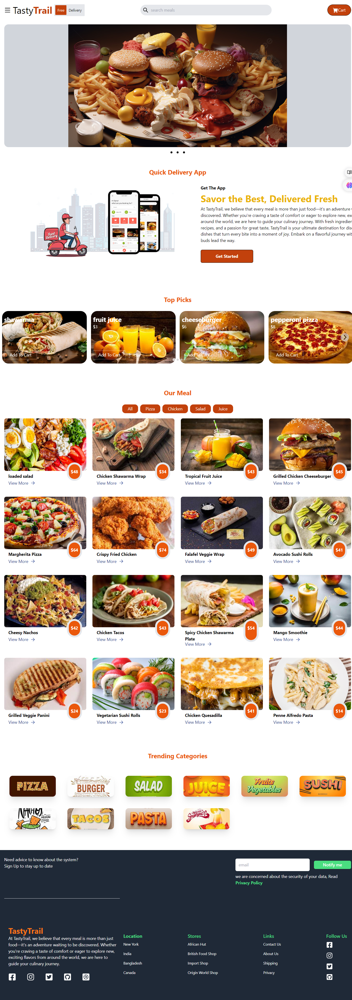

# 🍔 TastyTrail - Food Delivery Web Application

TastyTrail is a modern and responsive food delivery web application built with **React.js** and **Tailwind CSS**. The platform allows users to browse food items, explore trending categories, view featured meals, and enjoy an engaging user experience inspired by modern food delivery services.

## 🚀 Features

### 🏠 Home Page

* Attractive hero banner with food slider
* Responsive navigation bar
* Search functionality UI
* Shopping cart button

### 🍕 Food Menu

* Browse a variety of meals
* Food cards with images and pricing
* Detailed food listings
* Category-based filtering

### ⭐ Top Picks

* Featured food recommendations
* Popular meals showcase

### 🔥 Trending Categories

* Pizza
* Burger
* Salad
* Juice
* Sushi
* Tacos
* Pasta
* Fruits & Vegetables

### 📱 Responsive Design

* Mobile-friendly layout
* Tablet support
* Desktop optimized UI

### 🎨 Modern User Interface

* Clean design
* Smooth layout structure
* Tailwind CSS styling
* Interactive components

---

## 🛠️ Tech Stack

### Frontend

* React.js
* JavaScript (ES6+)
* Tailwind CSS

### Libraries

* Heroicons
* React Components

### Development Tools

* VS Code
* Git
* GitHub

---

## 📂 Project Structure

```bash
food/
│
├── public/
│   ├── favicon.ico
│   ├── logo192.png
│   ├── logo512.png
│   └── manifest.json
│
├── src/
│
├── package.json
├── package-lock.json
├── tailwind.config.js
├── .gitignore
└── README.md
```

---

## ⚙️ Installation

### Clone Repository

```bash
git clone https://github.com/ProvaPaul/TastyTrail.git
```

### Navigate to Project Folder

```bash
cd TastyTrail/food
```

### Install Dependencies

```bash
npm install
```

### Start Development Server

```bash
npm start
```

or

```bash
npm run dev
```

---

## 📸 Screenshots

### Home Page

Add your project screenshot here:

```md

```

---

## 🎯 Learning Outcomes

Through this project I learned:

* React Component Architecture
* State Management Basics
* Tailwind CSS Styling
* Responsive Web Design
* UI/UX Design Principles
* Reusable Components
* Git & GitHub Workflow

---

## 🔮 Future Improvements

* User Authentication
* Shopping Cart Functionality
* Checkout System
* Payment Gateway Integration
* Backend API Integration
* Order Tracking
* User Reviews & Ratings
* Admin Dashboard

---

## 👩‍💻 Author

**Prova Paul**

* GitHub: https://github.com/ProvaPaul
* LinkedIn: https://www.linkedin.com/in/prova-paul-352a61320/

---

## ⭐ Support

If you like this project, please consider giving it a ⭐ on GitHub.

---

## 📄 License

This project is developed for educational and learning purposes.
